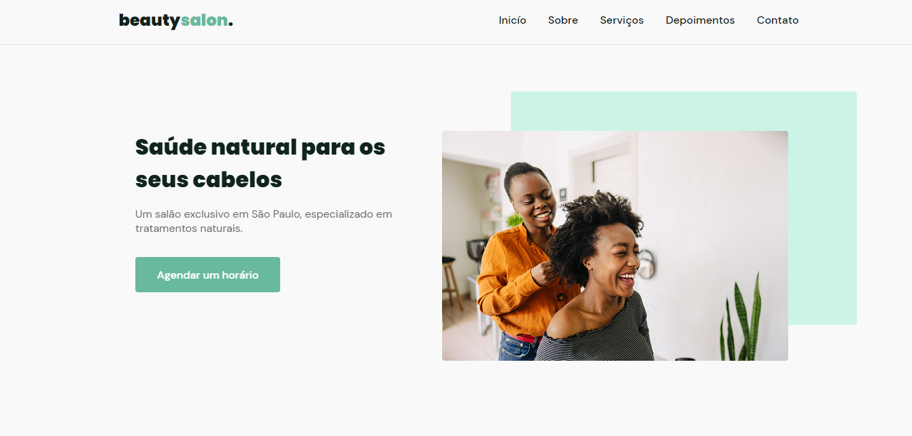
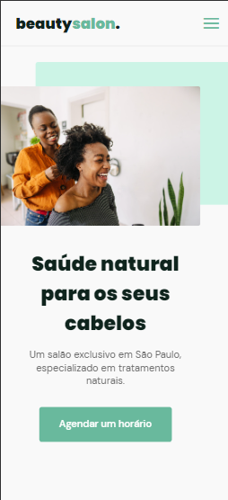

<h1 align="center">✨ Beauty Salon ✨</h1>

  Projeto responsivo desenvolvido nas trilhas da <strong>Rocketseat</strong>, com foco em layout moderno, navegação suave e boas práticas de HTML, CSS e JavaScript.

 

## 📍 Visite o projeto online  
🔗 [Clique aqui para acessar o site](https://eaealana.github.io/BeautySalon/)

 

## 📝 Descrição  
Este projeto foi criado com o objetivo de praticar a construção de interfaces web e simular um site institucional de salão de beleza. A ideia principal é atrair clientes e transmitir uma experiência visual encantadora, com foco em responsividade e design limpo.

 

## 🚀 Funcionalidades  
- Página de apresentação do salão  
- Seções com serviços oferecidos  
- Layout responsivo para dispositivos móveis  
- Botão de contato para agendamentos

 

## 🛠 Tecnologias utilizadas  
- HTML5  
- CSS3  
- JavaScript

 

## 💡 Aprendizados  
Esse projeto marcou meu início na jornada como desenvolvedora! Foi onde tudo começou — desde a estruturação básica de um site até o entendimento de responsividade, sem esquecer os primeiros passos com JavaScript para interações simples. Hoje olho com carinho e orgulho para essa fase 🌱✨

 

## 💻 Imagens do Projeto  

  
    
  

 
